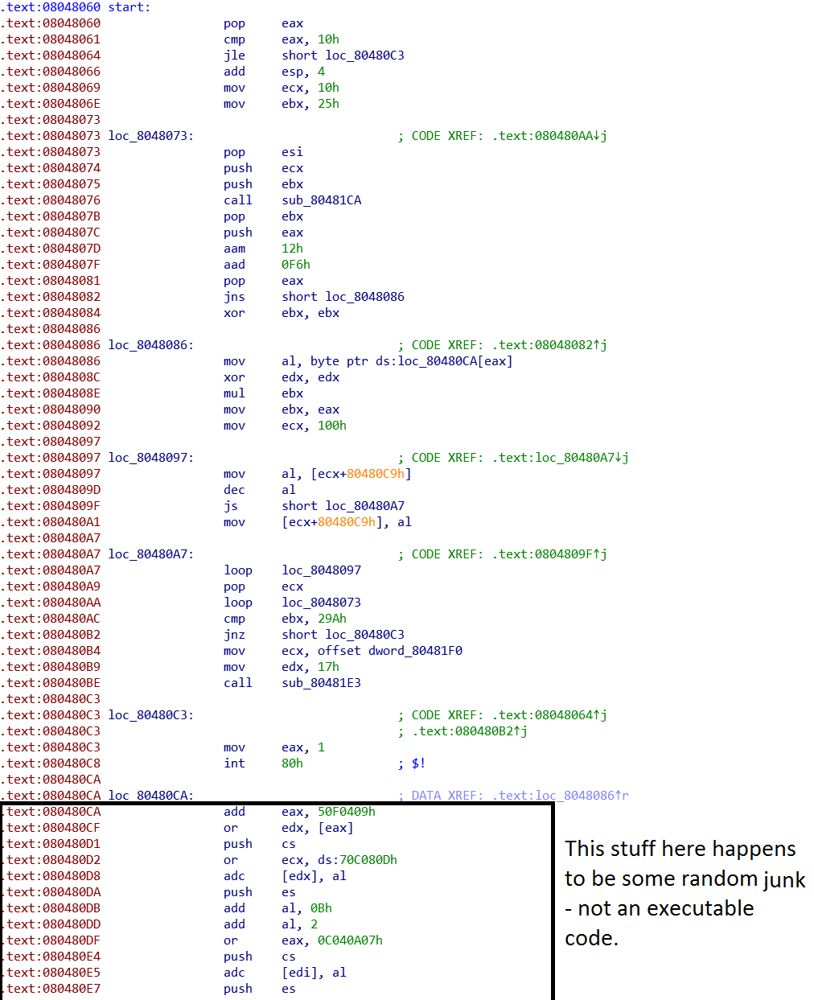
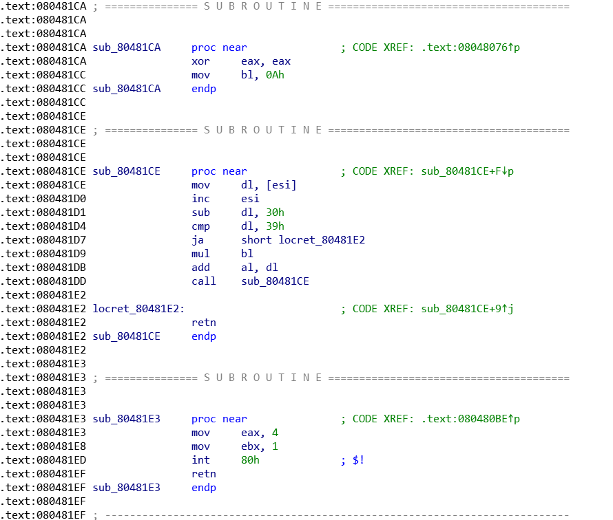
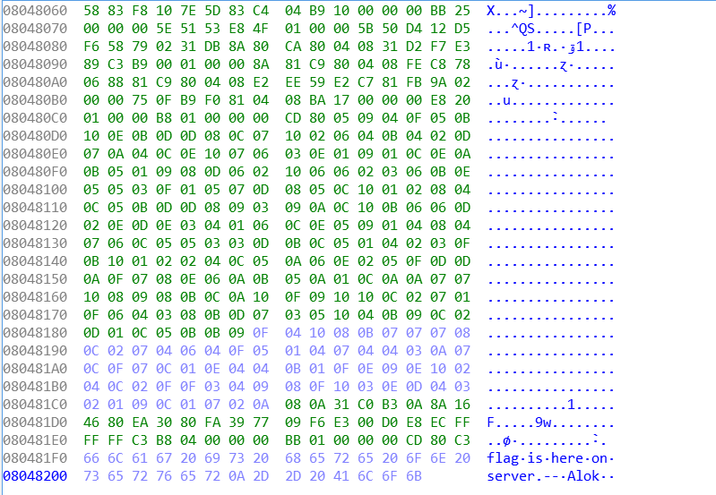
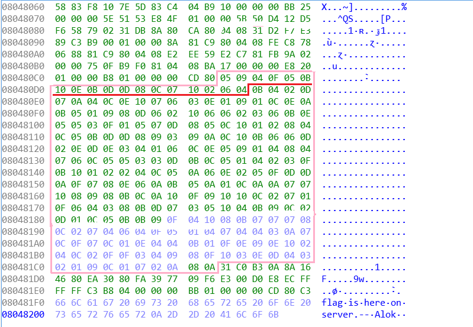

C6: gates of hell
=================

Category: reverse engineering

Statement
---------

Will be there as soon as the challenge page will reappear.

Solution
--------

We are given an ELF binary and our task (as with most of the RE tasks) is to guess the correct input to the program. Let's fire up the IDA disassembler and load our binary.

Here is the disassembled code:



And here are some subroutines called:



And there is hex of the whole binary (which is relatively small):



The first thing that pops up in the hex view is the "flag is here on server." string at ```0x080481F0```. We can see that it's being referenced in instruction at ```0x080480B4```, so our task will be to reach this point after running the binary with correct input. The instruction before is ```cmp ebx, 29Ah``` (and 29A in hex is 666). So our task is basically to make sure the value of ebx will be equal to 666 during the comparison.

Let's try to analyse the asm code step by step from the beginning: program starts with poping value from stack into ```eax``` register and comparing it with ```0x10``` which is 16 in hex. If ```eax``` value is smaller than 16 it jumps to ```loc_80480C3``` which, as we can see, simply exits from the program. Also there is no reference to any kind of scanning function, therefore we can deduce that our input will be provided in program arguments and we must provide at least 16 of them.

After this check ```ecx``` is set to 16 and ```ebx``` is set to 37. Then the subroutine at ```0x080481CA``` is called. Let's take a look at it:

```
.text:080481CA                 xor     eax, eax
.text:080481CC                 mov     bl, 0Ah

blah blah blah

.text:080481CE                 mov     dl, [esi]
.text:080481D0                 inc     esi
.text:080481D1                 sub     dl, 30h
.text:080481D4                 cmp     dl, 39h
.text:080481D7                 ja      short locret_80481E2
.text:080481D9                 mul     bl
.text:080481DB                 add     al, dl
.text:080481DD                 call    sub_80481CE
.text:080481E2 locret_80481E2:                         ; CODE XREF: sub_80481CE+9↑j
.text:080481E2                 retn
```

Remember that as with most of the RE tasks we don't have to understand EXACTLY what's going on. It is sufficient to grasp a sense of what's going on in the code. And with the help of GDB and by the fact that we subtract 48 (code of ascii '0') from something and compare it to 57 (code of ascii '9') we can deduce that this function simply turns string from input to number and stores it in the ```eax``` register.

Coming back to the main subroutine, we have first argument put as a number to ```eax``` and then there is this weird thing:

```
.text:0804807D                 aam     12h
.text:0804807F                 aad     0F6h
.text:08048082                 jns     short loc_8048086
```

From now on we will refer to it as "the filter". It checks if our input argument passes the filter (which we will discuss further) and if yes then it skips instruction at ```0x08048084```. And this instruction skipped is really bad as it sets ```ebx``` register to zero. Why is it bad? Remember that at some point, this register must be equal to 666 in order for the flag to be printed out. Highlighting the ```ebx``` we can see that the only operation that is changing its value is multiplication. And it basically means that once it turns into 0 it's over.

Let's imagine that for a while the filter is not present (therefore every argument gets accepted at this point). The next part is this bit of code:

```
.text:08048086                 mov     al, byte ptr ds:loc_80480CA[eax]
.text:0804808E                 mul     ebx
.text:08048090                 mov     ebx, eax
```

The first ```mov``` puts value at position ```0x080480CA + our input from eax``` into ```eax``` register. It also treats our input value as byte (therefore we know that only reasonable values to input are between 0 and 255). The next part is basically: ```ebx = ebx * eax```. So the value in ebx is multiplied by the value read from memory. After this the ```ecx``` is set to 256 and then the following piece of code is executed:

```
mov     al, [ecx+80480C9h]
.text:0804809D                 dec     al
.text:0804809F                 js      short loc_80480A7
.text:080480A1                 mov     [ecx+80480C9h], al
```

It's followed by ```loop loc_8048097``` which takes ```ecx``` and repeat this procedure decreasing ```ecx``` by 1 until it reaches zero. This roughly translates to:
```
for (ecx = 256; ecx > 0; ecx--)
{
    if (memory[0x080480C9 + ecx] > 0)
        memory[0x080480C9 + ecx]--;
}
```

So this loop decreases every positive value in memory chunk from ```0x080480CA``` to ```0x080481CA``` by one. Also notice, that this chunk of memory is the same that is used to multiply ```ebx``` by. Then there is next loop:

```
.text:080480A9                 pop     ecx
.text:080480AA                 loop    loc_8048073
```

So the same procedure is being repeated for all 16 arguments from our input. Then there is our ```ebx == 666``` check. So know we kind of know what to do. We have an array (chunk of memory from ```0x080480CA``` to ```0x080481CA```):



For every of 16 arguments we provide at the input the following procedure is called:

* Let's call our argument x
* ebx (equal to 37 at the beginning) is multiplied by the x-th entry in the array
* Every non-zero entry is decreased by one

So our task is simple! Let's factor 666: ```2 * 3 * 3 * 37```. 37 is there from the beginning, so we must provide such arguments that one of them will result in number from array equal to 2, two of them equal to 3 and rest of them equal to 1. Instead of two numbers equal to 3, we can of course provide one number equal to 9 and etc. The task would be rather simple if it weren't for the filter.

Let's take a look at it once more:
```
.text:0804807D                 aam     12h
.text:0804807F                 aad     0F6h
.text:08048082                 jns     short loc_8048086
```

It takes our variable at ```eax``` and perform two weird operations on it: ```aam``` and ```aad```. Googling it up we can find that they do the following:

```
store eax % 0x12 (=18) in al and eax / 0x12 in ah
add ah * 0xF6 (=246) to al
```

Then there is the ```jns``` which checks if sign flag is on and the value of sign flag depends on the result of the last arithmetic operation - aad in this case. The sign flag is lit if the most significant byte of used register is lit. The register used by aad is al so it simply checks if ```al``` > 127. So we would like ```al``` to be less than 127. Seems pretty complicated. But there is one thing that we can know for sure: if our input was smaller than 18 then the value put in ```ah``` during aam was 0 and therefore the aad won't add anything to ```al``` so it will still remain smaller than 18 (so <= 127). So we can safely use the values from 1 do 17 as our input. And it happens to be enough to solve this challenge!

Now it's time to find the values from first 17 elements of the array that will give us a product of 2*3*3. First let's look for all entries that can be used as factor 1 (as it will appear at least 13 times). There is no 1 in the array so surely our first entry will be equal to a bigger factor. For the second argument every 2 from array will turn into 1 so we can use the 15-th entry (counting from 0). For the third argument there once more is no 3 so it will be equal to a bigger factor. The fourth argument can be 2. The fifth can be 0. Sixth can be 16. 7th - 13. 8th - 11. 9th - 1. 10th (that is 0A) is again not present in the array. 11th - 5. 12th - 12. 13th - 10. 14th - 7. 15th - 3. 16th - 6. And for the 1st, 3rd and 10th argument we must find larger numbers whose product is equal to 18. The first argument can be equal to 2 (position 15). Third equal to 3 (5 before decreasing - position 0). Tenth equal to 3 (12 before decreasing - position 12).

So let's try to run: ```./gates-of-hell 15 15 0 2 0 16 13 11 1 12 5 12 10 7 3 6```

It works! Now the last part of the challenge is to figure out how does the website ```https://thawing-garden-44258.squarectf.com/cgi-bin/gates-of-hell.pl``` work. Turns out you just have to put ?args at the end of the url. So our adress is ```https://thawing-garden-44258.squarectf.com/cgi-bin/gates-of-hell.pl?15 15 0 2 0 16 13 11 1 12 5 12 10 7 3 6``` and we get a flag!

```flag-526f64696e0000666```

Cool!
