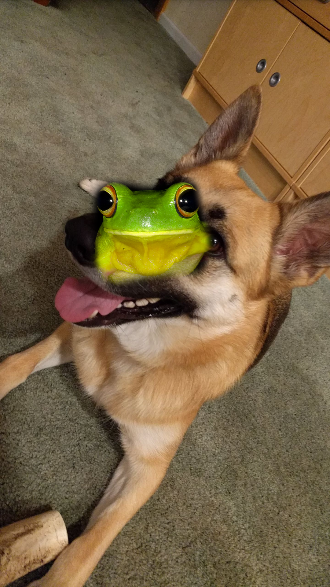
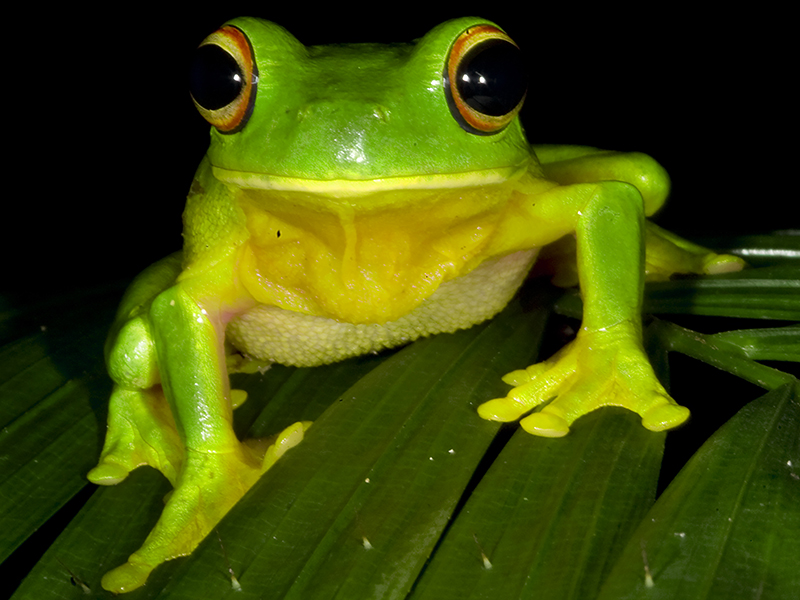
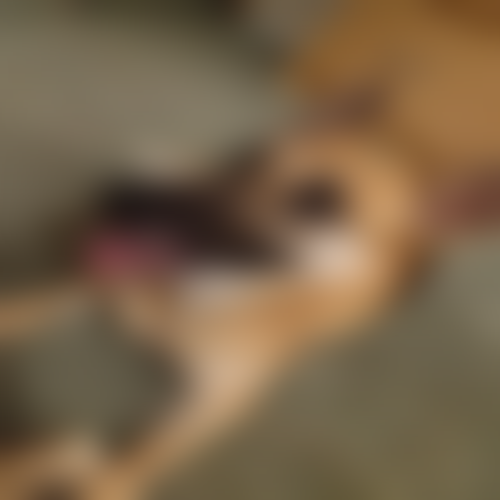
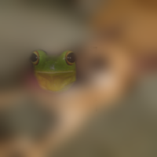
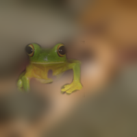

Dog or Frog
===========

900 pts, 77 solves

Statement
---------

Dressing up dogs are kinda the new thing, see if you can get this lovely girl ready for her costume party. [Dog Or Frog](http://2018shell2.picoctf.com:5467/)

Solution
--------

Be aware that what you're going to read is DEFINETLY NOT the intended solution to this problem. Most of the solutions probably base on the fact that neural networks are stupid and easy to fool. Digging through the links provided on challenge site, you can find some pdf files containing description of some optimization techniques used to turn dog into frog.

The solution I have found is (imo) much simpler (and also much less efficient, although the 95% required frog similarity was kind enough to let it be accepted :D). Also, instead of basing my solution on the stupidity of neural networks, I will exploit the fact that phash is extremely stupid as well. (Throughout the whole challenge I was using GIMP to edit our picture).
My whole solution was basically trial and error and figuring out how does the p hash and this certain NN works, so I will get straight to the point and describe what I found.

So.... what's the best way to turn an image of a dog into an image of a frog? Well, inserting the image of frog into it, of course! (like this:)

Of course, there is no way that this kind of solution will get good results. It's still being recognised as a dog and the p hash is much bigger than it should be. You can always make the frog more transparent to reduce the p hash value, but still there is too much dog in the picture for neural network to be fooled. But believe it or not, this is a great starting point to generating our frog disguise!

Before we will move on to exploiting anything, we should find a top notch quality frog to work with. The neural network should be convinced as much as possible that your tree frog is a tree frog (a lot of images of frogs are being classified as 70% frog, 30% green mamba or something similar). I found this frog very effective, resulting in around 99% certainty that it's a tree frog:

Breaking the p hash
-------------------

There is a one, very very very extremely useful thing that you can notice while experimenting with the image. P hash simply doesn't care about the image quality. If you resize our dog to 30x30 pixels it would still return 0 bit difference with the original image. What does it mean? We can basically apply a huge blur to our dog (in my case it was a Gaussian Blur with 70px radius) and the result will still have 0 bit difference with the original image despite looking like this:

And guess what! There is no trace of dog left in this image for neural network to be found. So now we can focus on inserting frog, so that the p hash will not increase too much, but the neural network will notice our frog. And the second part of the task is now much easier, because the dog won't distract NN anymore :)

First of all, I placed the head of the frog at the Trixi's boop, because it's darker than rest of the image and it creates less contrast with the frog. Next I blended the frog a bit with the background, so that the p hash would be pleased even more.

This image gave 1 bit difference with p hash and around 40% of frog similarity (already much better than at the beginning, so now we must only convince our NN to believe that the frog is really there on the picture. The next thing I did was to play around with the frog opacity to find the "golden spot" (maximum possible frog content while maintaining p hash equal to 1). This raised the similarity by around 10%. The next thing I tried experimenting with was to uncover a bigger part of the frog, still trying to maintain the p hash value of 1. I ended up inserting a big part of frog's legs, becaused it didn't trigger the p hash, but it raised the NN confidence to 90%!

So close! But I had no more ideas to improve the image. I was about to give up, when I thought to myself: "Well, neural networks are very unpredictable and they often work in an incomprehensible manner. What if I did something very stupid?". So well, I decided to erase a small, totally random part of frog's stomach. And guess what..... ummmm .... I don't even know what happened and how did that happen, but here's the final image, that gives you the flag after posting on the site:

